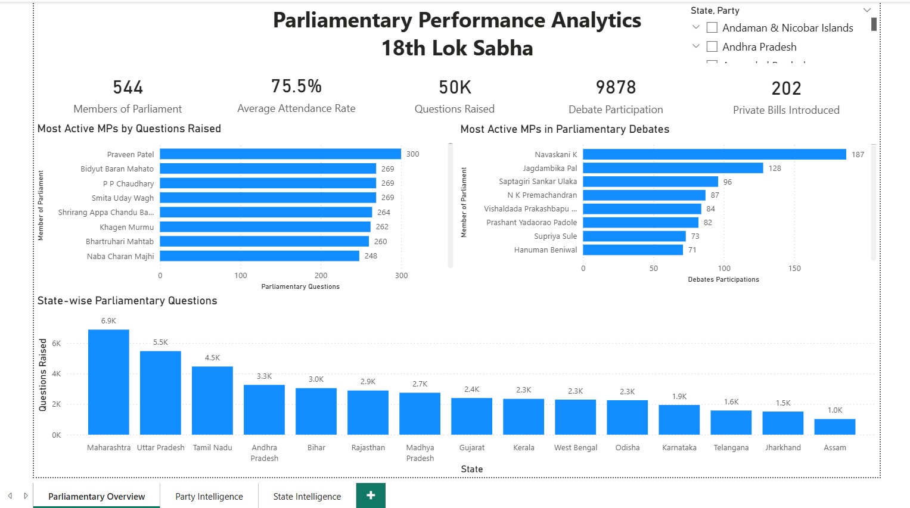
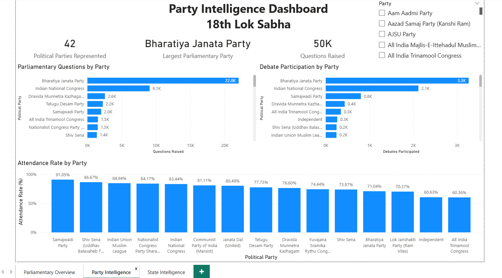
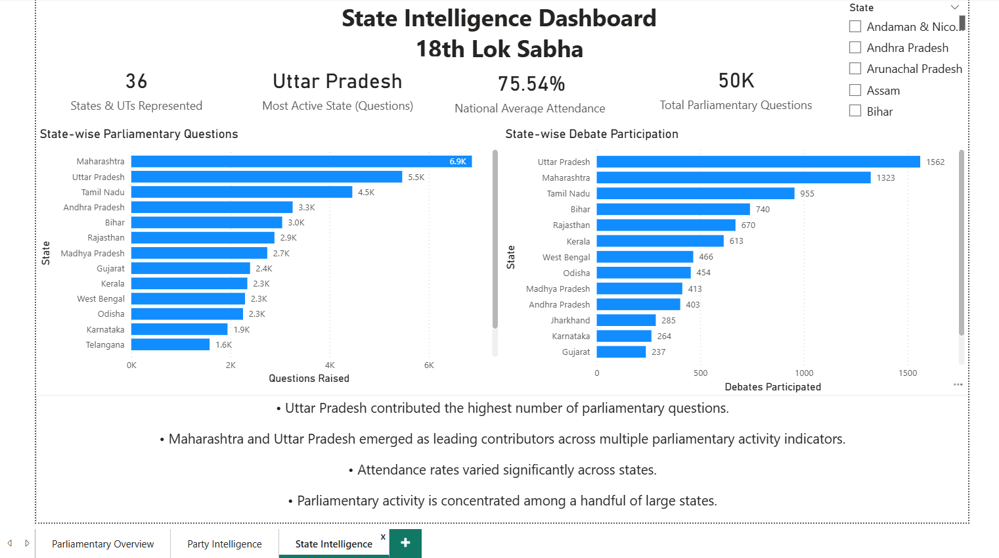

# Parliamentary Performance Analytics – 18th Lok Sabha

## Project Overview

This Power BI project analyzes parliamentary performance across Members of Parliament (MPs), political parties, and states in the 18th Lok Sabha.

The dashboard focuses on parliamentary participation through:

- Attendance Rate
- Questions Raised
- Debate Participation
- Private Member Bills
- Party-wise Analysis
- State-wise Analysis

## Tools Used

- Power BI
- Microsoft Excel
- DAX
- Data Cleaning
- Data Visualization

---

## Dashboard Pages

### 1. Parliamentary Overview

Key metrics:

- Members of Parliament
- Average Attendance Rate
- Questions Raised
- Debate Participation
- Private Bills Introduced

---

### 2. Party Intelligence Dashboard

Insights include:

- Parliamentary Questions by Party
- Debate Participation by Party
- Attendance Rate by Party
- Largest Parliamentary Party

---

### 3. State Intelligence Dashboard

Insights include:

- State-wise Parliamentary Questions
- State-wise Debate Participation
- National Attendance Trends
- Most Active States

---

## Key Findings

- Uttar Pradesh contributed the highest number of parliamentary questions.
- Maharashtra emerged as one of the most active states in parliamentary participation.
- BJP recorded the highest parliamentary activity among political parties.
- Parliamentary participation varies significantly across states and parties.

---

## Skills Demonstrated

- Power BI Dashboard Development
- DAX Calculations
- Data Cleaning and Transformation
- KPI Design
- Data Storytelling
- Business Intelligence Reporting

---

## Author

Saharsh Deshmukh
